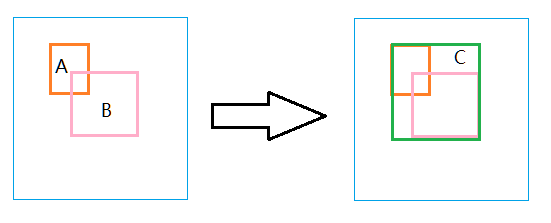

# 合并区间

|**索引**|[题目][题目]|[示例][题目]|[算法][算法]|[实现](#实现)|[返回目录][返回目录]|
|-|-|-|-|-|-|-|

## 实现

|领域|详细作用|示例|
|-|-|-|
|几何区域|求多个矩形块的最大重合矩形块||

[题目]:https://leetcode-cn.com/problems/merge-intervals/

[算法]:https://leetcode-cn.com/problems/merge-intervals/solution/he-bing-qu-jian-by-leetcode-solution/

[返回目录]:https://github.com/CloudSmokeMemory/WorldLogic/blob/main/realize/algorithm_realize/algorithm2realize/algorithm2realizeIndex.md#%E7%AE%97%E6%B3%95-%E5%AE%9E%E7%8E%B0%E7%9B%AE%E5%BD%95
