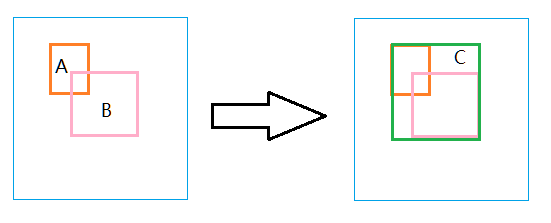

|**索引**|[题目](#题目)|[示例](#示例)|[实现](#实现)|[算法](#算法)|[来源](#来源)|[返回目录](https://github.com/CloudSmokeMemory/WorldLogic/blob/main/realize/algorithm_realize/algorithm2realize/algorithm2realizeIndex.md#%E7%AE%97%E6%B3%95-%E5%AE%9E%E7%8E%B0%E7%9B%AE%E5%BD%95)|
|-|-|-|-|-|-|-|
## 题目
给出一个区间的集合，请合并所有重叠的区间。

## 示例
#### 示例1
```
输入: intervals = [[1,3],[2,6],[8,10],[15,18]]
输出: [[1,6],[8,10],[15,18]]
解释: 区间 [1,3] 和 [2,6] 重叠, 将它们合并为 [1,6].
```
#### 示例2
```
输入: intervals = [[1,4],[4,5]]
输出: [[1,5]]
解释: 区间 [1,4] 和 [4,5] 可被视为重叠区间。
```

## 实现
|领域|详细作用|示例|
|-|-|-|
|几何区域|求多个矩形块的最大重合矩形块||

## 算法
|[C++](https://github.com/CloudSmokeMemory/WorldLogic/blob/main/realize/algorithm_realize/algorithm2realize/%E6%8E%92%E5%BA%8F/1_1%E5%90%88%E5%B9%B6%E5%8C%BA%E9%97%B4/%E5%90%88%E5%B9%B6%E5%8C%BA%E9%97%B4ByC%2B%2B.md)|[C]()|[C#]()|[Java]()|[Python3]()|
|-|-|-|-|-|

|[JavaScript]()|[Rust]()|[Go]()|[Swift]()|[Kotlin]()|
|-|-|-|-|-|

|[Scala]()|[PHP]()|[TypeScript]()|[]()|[]()|
|-|-|-|-|-|


## 来源
```
来源：力扣（LeetCode）
链接：https://leetcode-cn.com/problems/merge-intervals
著作权归领扣网络所有。商业转载请联系官方授权，非商业转载请注明出处。
```
